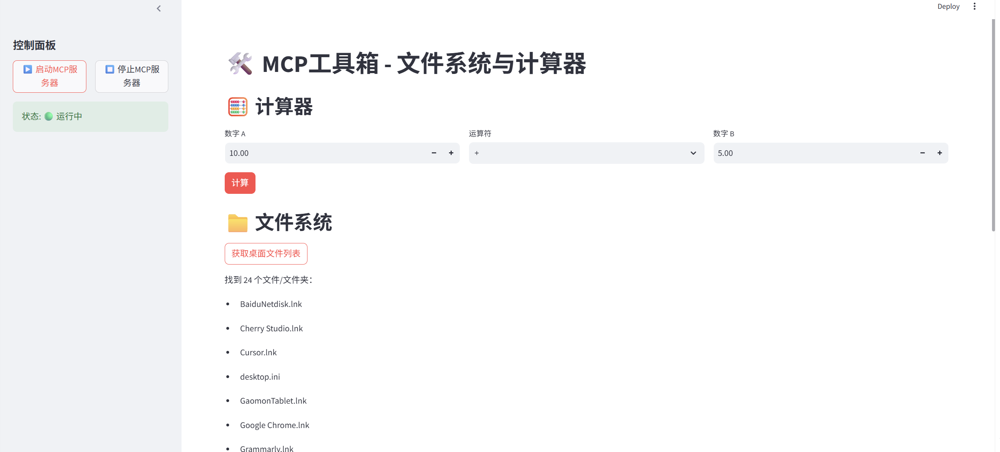

# MCP 工具箱 - 使用说明



## 📖 项目简介

这是一个基于 MCP (Model Context Protocol) 协议的工具箱演示项目，展示如何通过 MCP 协议让大模型动态发现和调用本地工具。

### 功能特性

- 🧮 **计算器工具** - 支持加减乘除四则运算
- 📁 **文件系统工具** - 获取桌面文件列表
- 🔌 **MCP协议演示** - 展示 tools/list 和 tools/call 标准流程
- 🖥️ **图形化界面** - 基于 Streamlit 的友好交互界面

## 📁 项目结构

```
MCP/
├── mcp_server.py          # MCP服务器端（提供工具）
├── simple_app.py          # Streamlit前端界面
├── run_mcp_app.py         # 自动启动脚本
├── 启动MCP工具箱.bat       # Windows一键启动
└── README.md              # 使用说明
```

## 🚀 快速开始

### 方式一：一键启动（推荐）

1. **双击运行** `启动MCP工具箱.bat`
2. 浏览器自动打开 http://localhost:8501
3. 点击左侧 **「启动MCP服务器」**
4. 开始使用！

### 方式二：命令行启动

```bash
# 1. 安装依赖
pip install streamlit mcp

# 2. 启动前端
streamlit run simple_app.py
```

## 📋 环境要求

- Python 3.10 或更高版本
- 已安装 pip

## 🔧 安装依赖

如果一键启动时自动安装失败，请手动执行：

```bash
pip install streamlit mcp
```

## 🎯 使用指南

### 1. 启动MCP服务器
- 打开左侧边栏
- 点击 **「启动MCP服务器」** 按钮
- 状态显示变为 🟢 运行中

### 2. 使用计算器
- 输入数字 A 和数字 B
- 选择运算符（+、-、*、/）
- 点击 **「计算」** 按钮
- 查看计算结果

### 3. 获取桌面文件
- 确保MCP服务器已启动
- 点击 **「获取桌面文件列表」**
- 查看桌面上的文件和文件夹

## 📡 MCP协议说明

MCP (Model Context Protocol) 是一个开放协议，包含以下核心功能：

### 工具发现 (tools/list)
客户端向服务器请求所有可用工具列表

### 工具调用 (tools/call)
客户端通过标准化接口调用具体工具

### 通信方式
使用 stdio（标准输入输出）进行进程间通信

## ❓ 常见问题

### Q: 启动时提示找不到 streamlit？
A: 请手动安装：`pip install streamlit`

### Q: 点击计算没反应？
A: 请先点击左侧「启动MCP服务器」

### Q: 端口8501被占用？
A: 关闭其他Streamlit应用，或使用不同端口：
```bash
streamlit run simple_app.py --server.port 8502
```

### Q: Windows提示安全警告？
A: 点击「更多信息」→「仍要运行」

## 📝 开发扩展

### 添加新工具

在 `mcp_server.py` 中添加：

```python
@mcp.tool()
def your_new_tool(param: str) -> str:
    """工具描述"""
    return f"处理结果: {param}"
```

重启MCP服务器即可自动发现新工具。

## 📄 许可证

MIT License

## 🔗 相关链接

- [MCP官方文档](https://modelcontextprotocol.io)
- [Streamlit官网](https://streamlit.io)

---

**祝使用愉快！** 🎉
